# F78Tool

## A Tool for Controlling Fire OS™ 7/8 Devices

### By Lighty / LightyUwU

#### Warning

I am **NOT** responsible for any damage to your devices resulting from the use of this tool!

This tool is **ONLY** to be used on Fire OS™ 7 and 8 systems.

Please verify that your device is running one of these versions, as otherwise it may be subject to **IRREVERSIBLE** damage.

**ONLY** use this tool on devices **YOU** or if you have received **EXPLICIT PERMISSION** from the **OWNER**!

**MISUSE** may result in permanent damage to a device, even if unlikely.

#### Credits

Payload (.payload.sh) : [XDA Forums : [SYSTEM USER] Fire Cube/Stick/TV/Tablet ≤ PS7704 (FireOS7) / RS8149 (FireOS8) by **Pro-me3us**](https://xdaforums.com/t/system-user-fire-cube-stick-tv-tablet-ps7704-fireos7-rs8149-fireos8.4759215/)

#### Usage

##### To Install, either grab it straight from the Releases page

- [Windows amd64](https://github.com/lightyyt/F78Tool/releases/latest/download/f78tool_windows.zip)

- [Linux amd64](https://github.com/lightyyt/F78Tool/releases/latest/download/f78tool_linux.tar)

##### Or download the source code, then

Make sure you have Python 3.10+ installed
(Check with: `python --version` in your terminal)

###### **Linux**

```sh
python3 -m venv .venv
source .venv/bin/activate
pip install -r requirements.txt
python main.py
```

###### **Windows**

```sh
pip install -r requirements.txt
python main.py
```

#### Features

- GUI with CustomTKinter (CTK)

- Ability to install Google Play® Services / Store

- Support for Fire OS™ 7 & 8 ONLY

#### How to Use

_(This only shows basic usage on how to switch launchers)_

##### 1. Set up Device with no Internet

_(If your device is already set up, you can skip this step)_

1. Set up your Language
    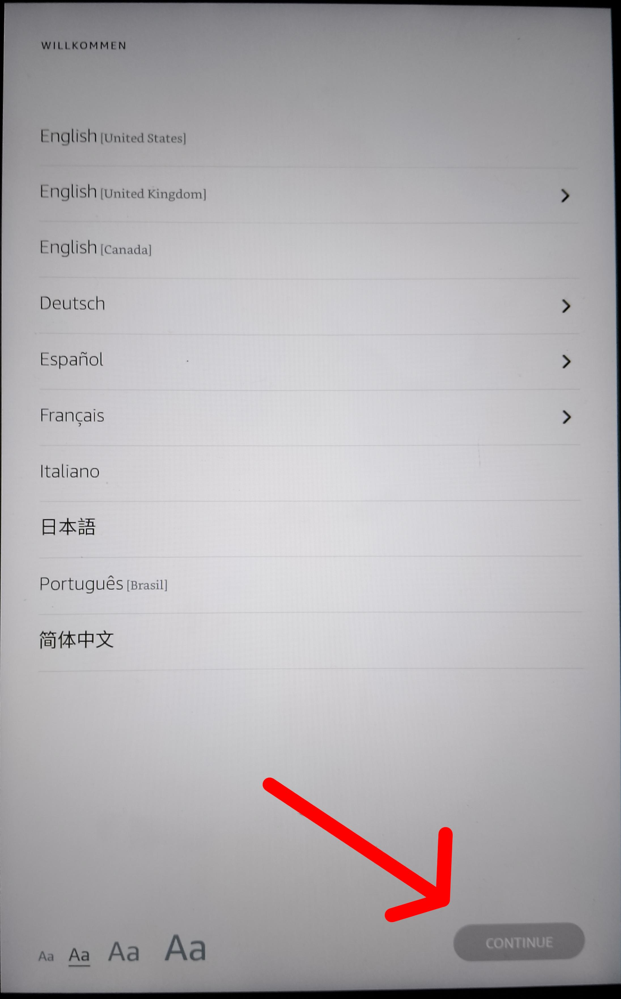

2. Select: "Set up Manually"
    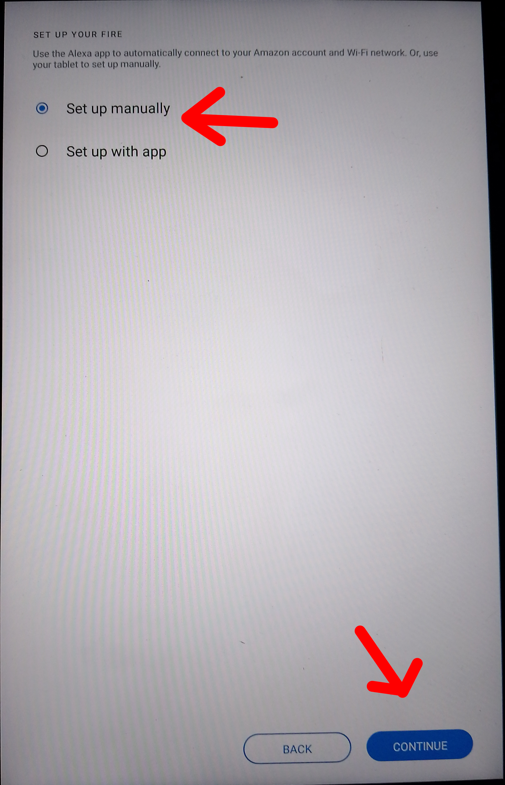

3. Select: "Add Network"
    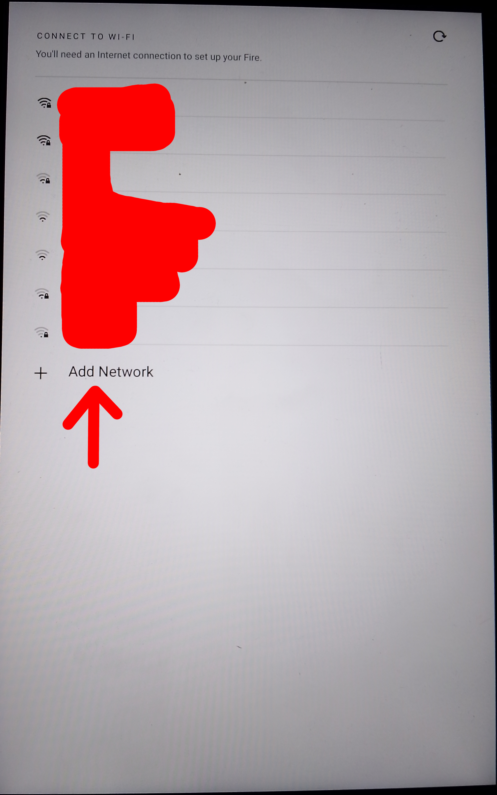

4. Select: "Cancel"
    

5. Select: "Skip Setup"
    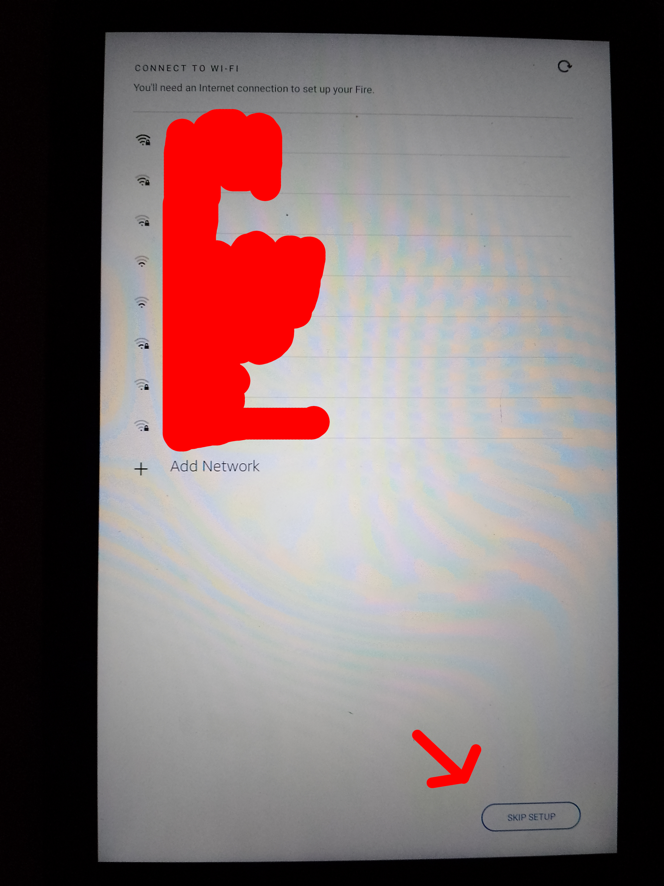

##### 2. Enable USB Debugging

_(You can skip this if you already did it)_

1. Go Into Settings and Select "Device Options"
    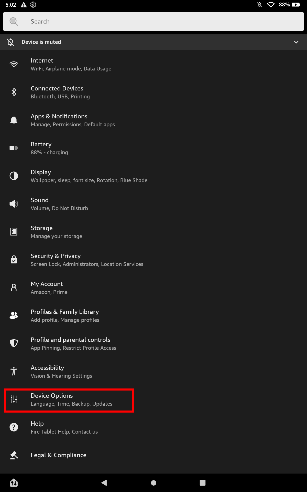

2. Go to "About Fire Tablet"
    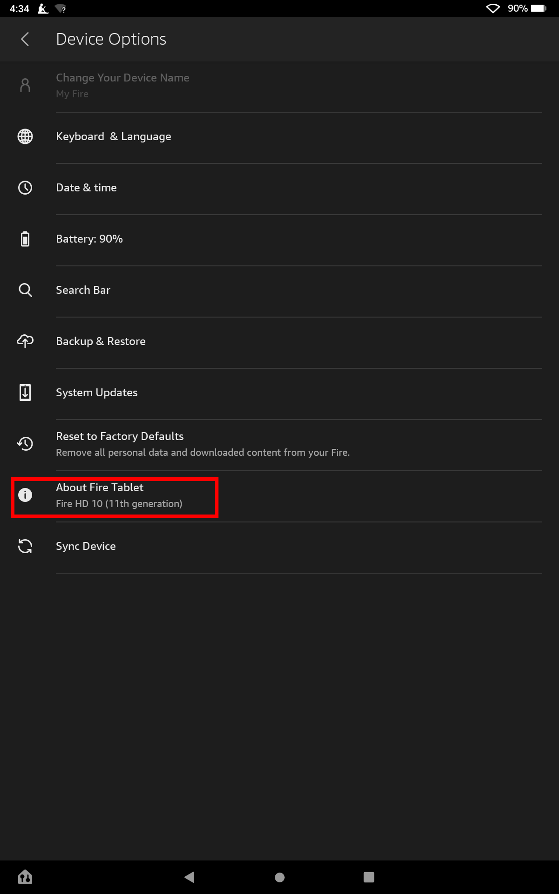

3. Tap the **SERIAL NUMBER** 5-10 times, then go back
    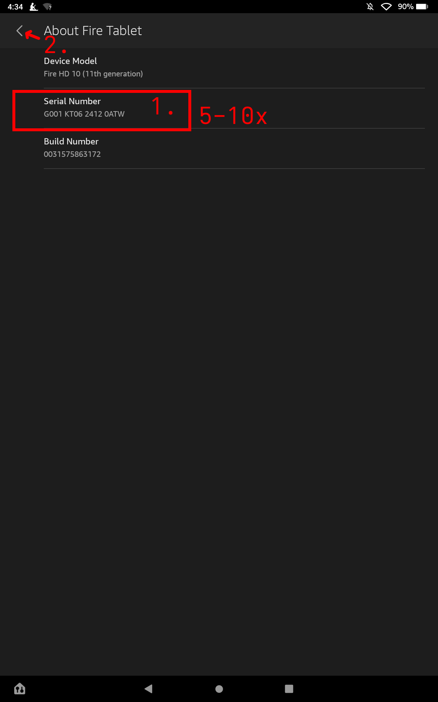

4. Go to Developer Options
    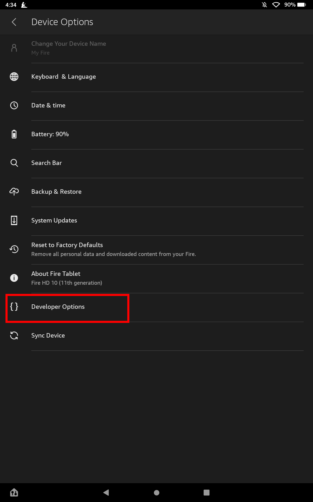

5. Turn Developer Options On
    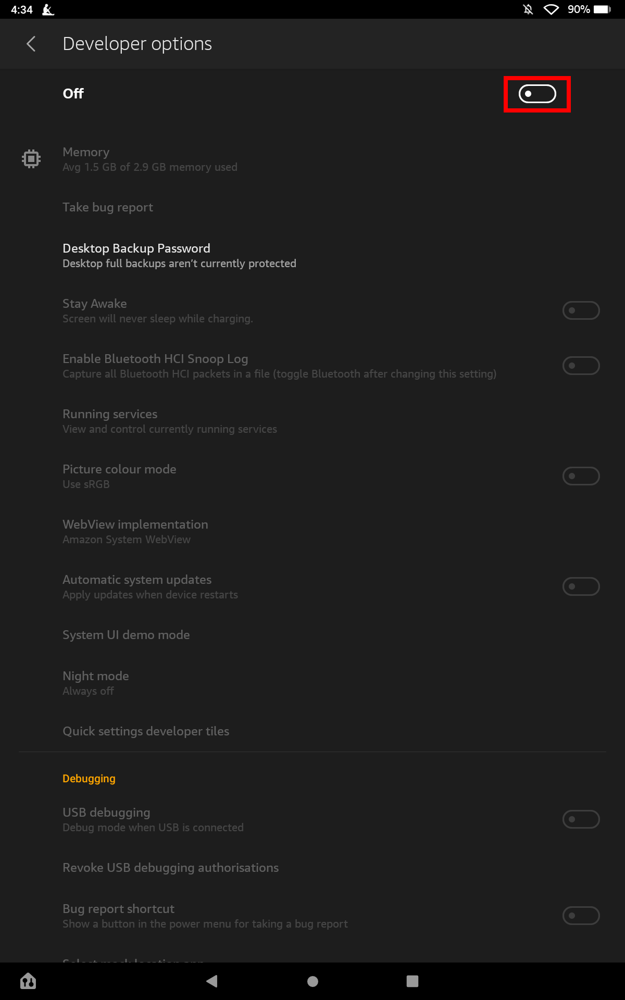

6. Turn USB Debugging On and go back to the Home Screen
    

##### 3. Start F78Tool
**From here, you should now follow the steps.**

1. Open F78Tool and follow the instructions
    If you see this on your device, follow the steps:
    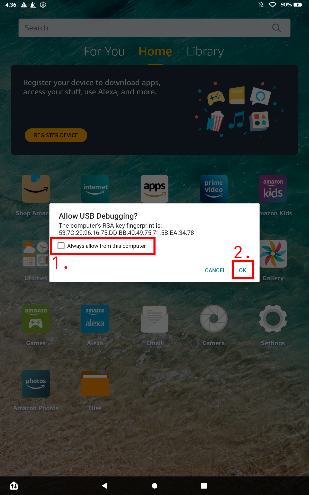

2. Once F78Tool Opens, select "Debloat"
    

3. Disable OTA, Remove the Fire Launcher _(and Select your Debloat Level)_
    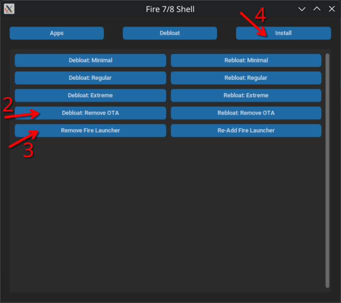

4. Install a new Launcher from the "Install Tab" _(and Optionally Google Play® Services)_
    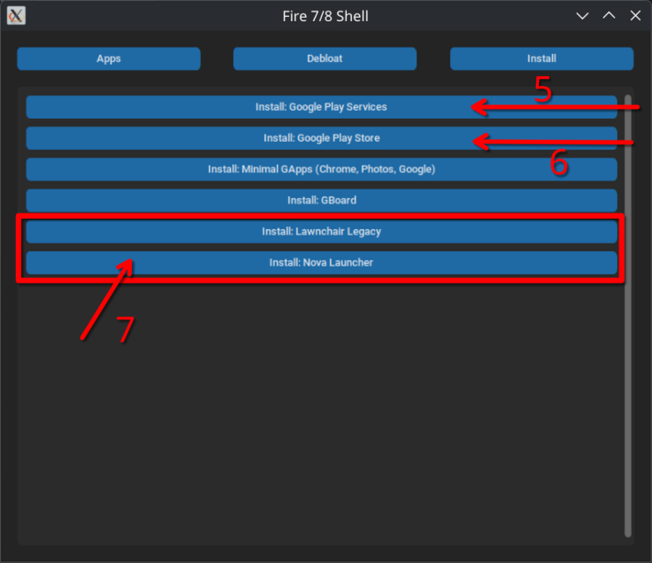
